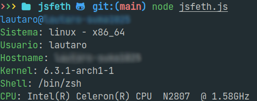

<h1 aling="center">JSfetch</h1>

Fetch inspirado en Neofetch escrito en Javascript usando modulos de NodeJS

Como usar:

Descargar el repositorio
```sh
# Usando git
git clone https://github.com/Lauta-dev/jsfeth.git

# Usando github cli
gh repo clone Lauta-dev/jsfeth
```

Instalar dependencias del projecto
```sh
npm i
```

ejecutar projecto
```sh
node jsfeth.js
```


